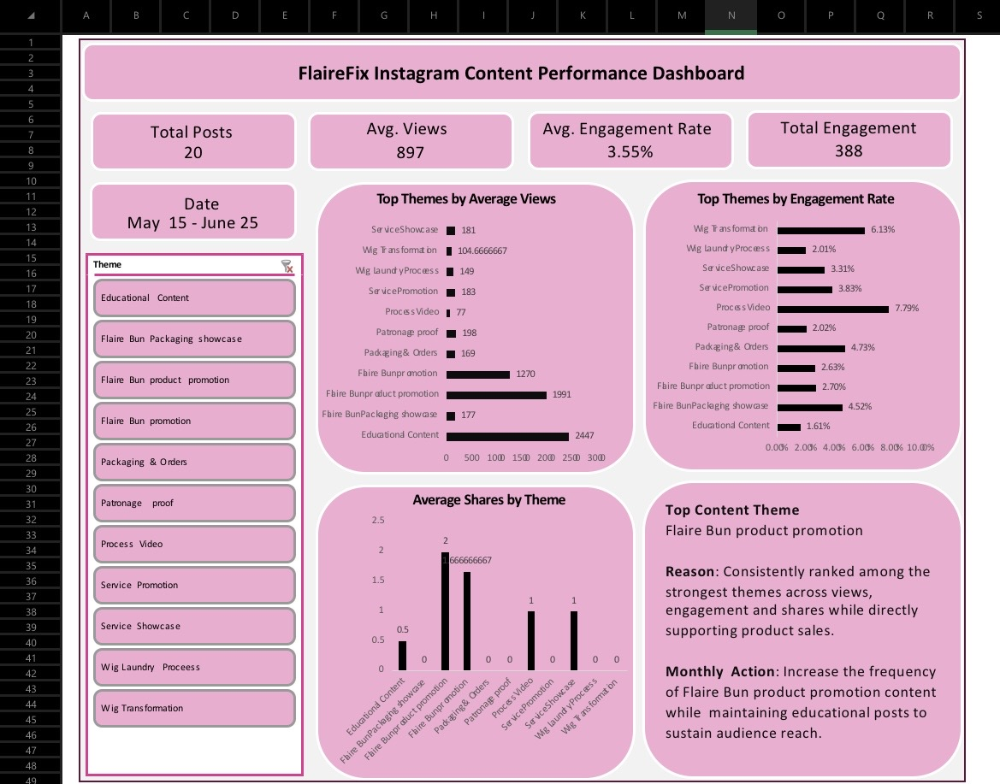

# Instagram-content-performance-analysis
Interactive Excel dashboard analyzing Instagram content performance to identify high-performing content themes and support data-driven content strategy for a beauty brand.

## Dashboard Preview

## Overview

This project analyzes the performance of Instagram content posted on the FlaireFix business account using Microsoft Excel.

The goal was to evaluate content performance, identify high-performing content themes, and generate actionable recommendations to improve future content strategy using data rather than assumptions.

## Business Problem

As a growing beauty brand, FlaireFix publishes different types of Instagram content including product promotions, educational posts, process videos and service showcases.

Without structured analysis, it is difficult to determine:
- Which content themes attract the most views.
- Which themes generate the highest audience engagement.
- Which types of content should be produced more frequently.
- How content performance can support business growth.

This dashboard was created to answer those questions.

## Objectives
- Analyze Instagram content performance using Excel.
- Compare different content themes.
- Measure audience engagement.
- Identify the strongest-performing content theme.
- Provide recommendations for future content planning.

## Dataset

The dataset contains performance metrics from 20 Instagram posts published between 15 May and 25 June.

### Metrics included
- Date
- Content Theme
- Views
- Likes
- Comments
- Shares
- Total Engagement
- Engagement Rate

## Tools Used
- Microsoft Excel
- Pivot Tables
- Pivot Charts
- Slicers
- Calculated Columns
- Dashboard Design

## Dashboard Features

The dashboard includes:
- KPI Cards
- Total Posts
- Average Views
- Average Engagement Rate
- Total Engagement
- Interactive Theme Slicer
- Average Views by Theme
- Average Engagement Rate by Theme
- Average Shares by Theme
- Top Content Theme
- Monthly Content Recommendation

## Key Insights
- Educational content generated the highest average views, making it the strongest content for audience reach.
- Process videos recorded the highest engagement rate, indicating strong audience interaction despite lower overall reach.
- Flaire Bun product promotion consistently performed well across multiple performance metrics while directly supporting product sales.
- Different content themes contribute differently to business objectives, highlighting the importance of maintaining a balanced content strategy.

## Business Recommendation

Increase the frequency of Flaire Bun product promotion content while maintaining educational content to continue building awareness and supporting product sales.
